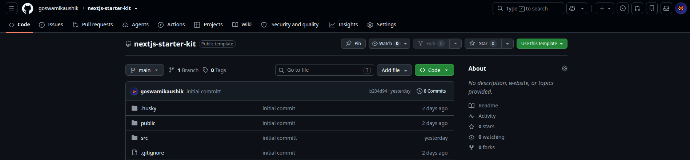

# Standardizing Frontend Engineering: The Next.js Starter Kit

Hi Acowale Team! I wanted to share the custom boilerplate I use to launch frontend projects with modern conventions, zero drift, and high velocity.

You can bootstrap any new frontend repository using this starter kit by navigating to the GitHub repository [goswamikaushik/nextjs-starter-kit](https://github.com/goswamikaushik/nextjs-starter-kit) and clicking the **"Use this template"** button:



---

### What it Contains & Why it Helps Us Scale

#### 1. Feature-Based Co-location (No Architecture Drift)

Instead of dividing files by technical layers (e.g., grouping all components together, all hooks together), files are co-located in `src/features/{group}/{feature}/`. Next.js App Router files (`src/app/`) are kept as thin shells that merely render these self-contained features.

#### 2. Automatic Performance (React Compiler)

The template enables the React 19 compiler (`reactCompiler: true` in `next.config.ts`), shifting the burden of memoization from developers to the build engine. Standard hook calls like `useMemo` and `useCallback` are forbidden.

#### 3. Modern Routing & Middleware (`proxy.ts`)

Next.js 16 uses `src/proxy.ts` instead of `middleware.ts`. This starter kit provides a pre-configured routing gateway that appends request-time path headers (`x-current-path`), letting pages retrieve dynamic metadata seamlessly.

#### 4. Type-Safe Environment Variables

All access to environment variables runs through a Zod-validated schema in `src/lib/env.ts`, throwing clear exceptions at startup rather than failing silently at runtime.

---

### Project Structure Map

```
src/
├── app/                    # Next.js App Router (thin page shells only)
│   ├── (app)/              # Authenticated app routes: /dashboard, /profile, /charts
│   ├── (auth)/             # Auth routes: /sign-in, /sign-up, /forgot-password
│   └── (marketing)/        # Public routes: /, /about, /contact-us
├── features/               # Co-located domain components and business logic
├── components/
│   ├── ui/                 # shadcn/ui primitives (Developer READ-ONLY)
│   └── common/             # Custom shared components composing ui primitives
├── constants/              # Centralized route registry (SITE_ROUTES)
├── redux/                  # Centralized Redux Toolkit + persistence store
└── proxy.ts                # Next.js 16 path & routing middleware
```

---

### Strict Quality Verification (Husky + lint-staged)

The boilerplate prevents bad code from reaching production. It utilizes **Husky** git hooks paired with **lint-staged** to run **Prettier** formatting, **ESLint** diagnostics, and strict **TypeScript type checking** (`pnpm check-types`) on staged files prior to every commit, keeping the main branch clean.
